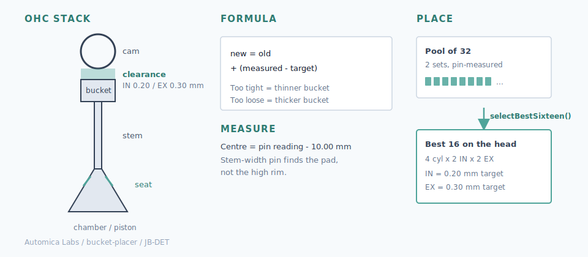

# Bucket Placer

Daihatsu Copen **JB-DET** cam-bucket catalog and clearance-based placement.



## Why this exists

The first-generation Daihatsu Copen (L880) and its **JB-DET** kei engine are long out of production. Replacement shimless valve lifters (cam buckets) in specific thicknesses are hard or impossible to buy new in useful sizes. When rebuilding a head, you cannot simply order a fresh set and walk away.

This project exists to **reuse what you have**: measure a pool of used buckets accurately, ignore the misleading side stamps, then pick and place the best 16 against real cold clearances. It is a scrap-yard and spare-engine problem turned into a small engineering workflow, because the supply chain for an obsolete car no longer covers the valvetrain.

Two full sets (32 buckets) from a pair of engines, one of which had a head gasket failure, are the working stock.

## How wear happens

Each bucket sits between a cam lobe and a valve stem tip. Over time the lobe polishes a dish into the cam face:

1. **Early wear** is concentrated in the centre. A flat micrometer anvil bridges the dish and sits on the high rim, so the reading looks thicker than the true centre.
2. **Later wear** can take the whole face down, so rim and centre converge. Exhaust valves run hotter and often wear faster, which is why exhaust clearance targets are larger and why thin buckets tend to cluster on that side.
3. **Heat and oil problems** (for example after a head gasket failure) can accelerate face wipe across the pad, not just a neat centre dish.

The side stamp is the factory thickness code. Once the face has worn, that number is historical. Placement must use **measured centre thickness**, not the stamp.

### Why the pin guide matters

A flat micrometer alone is the wrong tool once the face is dished: the anvils sit on the rim and overstate thickness. The measuring sleeve (`bucket-measure-sleeve.scad`) drops into the bucket bore and holds a pin of known length (**10.00 mm**) so the tip finds the centre of the pad. Micrometer reading minus pin length is the centre thickness used for placement.

Without that, the catalogue would repeat the rim bias we saw on set 1 (many buckets looking ~3.4 mm on the rim while the centre sat near ~3.0 mm). The sleeve is a cheap fixture so every bucket is measured the same way.

Lapping or recutting valve seats recesses the valve into the head and **tightens** clearance. That often makes thinner worn buckets useful again after a valve job, instead of demanding thick new parts you cannot buy.

## What the tool does

Records measured centre thickness for each bucket, then assigns the best 16 from a pool of up to 32 against cold intake/exhaust clearance targets.

## Cold valve clearance (JB-DET)

| Side | Target | Allowed range |
|------|--------|---------------|
| Intake | **0.20 mm** | 0.17–0.25 mm |
| Exhaust | **0.30 mm** | 0.27–0.35 mm |

## Daihatsu selection formula

```text
new thickness = installed thickness + (measured clearance − specified clearance)
```

- Gap **too small** → thinner bucket  
- Gap **too large** → thicker bucket  

## Workflow

1. Catalog buckets (stamp, rim reading, pin reading) in `cam-buckets.ts`
2. Print / rebuild the measuring sleeve from `bucket-measure-sleeve.scad` (pin length **10.00 mm**)
3. Centre thickness = pin reading − 10.00
4. Install any 16, fit cams, measure cold gaps — note `set:letter` per port (`1:A`, `2:C`, …)
5. Run `selectBestSixteen()` to place the best 16 from the full pool; leftovers are spares

## Bucket report

Print the current catalog, including measured thickness, nominal factory size,
and wear:

```bash
npm run report:buckets
```

## Stamp sizing (this catalog)

Factory table uses **0.020 mm** steps:

- Code `01` → 2.500 mm  
- Code `18` → 2.840 mm  
- Code `24` → 2.960 mm  
- `nominal = 2.48 + stamp * 0.02`

## Project layout

| File | Role |
|------|------|
| `cam-buckets.ts` | Inventory, pin math, clearance constants |
| `assign-buckets.ts` | Port map + `selectBestSixteen()` |
| `bucket-measure-sleeve.scad` | 3D-printed M3 pin guide |
| `tests/formula.test.ts` | Formula and assignment tests |

## Develop

```bash
npm install
npm run report:buckets
npm test
```

## CI

GitHub Actions runs `npm ci` and `npm test` on every push and pull request to `master`.
